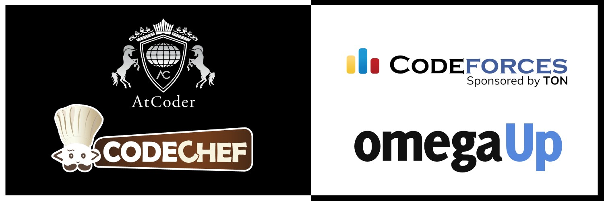

# Competitive Programming Tracker

This tool reads a CSV file with usernames for **AtCoder**, **CodeChef**, **CodeForces**, and **OmegaUp**, fetches how many problems each user has solved, and outputs a clean `.txt` summary.

## Why This Exists

In a university course, students had to solve competitive programming problems across four platforms. The number of problems solved was part of their grade.

This script automates the task of checking each platform manually, making grading easier and faster.

## Usage

1. **Install Python 3.8+**  
   [Download Python](https://www.python.org/downloads/)

2. **Install Git**   
   [Download Git](https://git-scm.com/downloads)

3. **Clone Repository**   
    Clone the repo locally using the command: `git clone https://github.com/rgdan/Competitive-Programming-Tracker` and access the repo using `cd Competitive-Programming-Tracker`

4. **Install Requirements**   
   Run the command `pip install -r requirements.txt` to install the required libraries

5. **Run Script**   
   Run the script using the command: `python3 main.py`

6. **Give Script Neccesary Info**   
   The script will ask you for the path to the `.csv` file with usernames, the format for this file can be found below.   
   In addition to that it will also ask you for a token for AtCoder. For instructions on how to get this token refer to [AtCoder.md](documentation/atcoder.md)

## I/O

### Input

You need a .csv file that contains one row per student, with their usernames on each platform.

#### Example Format

```csv
Name,AtCoder,CodeChef,CodeForces,Omegaup
Henry,at_snek,chef_l33t,cf_overflow,omega_void
William,at_rainbow,chef_9000,cf_dreams,omega_whirl
```

### Output

It'll output a `.txt` file named `results.txt` in the same directory as the script.

#### Example Format

```txt
Name            | AtCoder | CodeChef | CodeForces | AC+CC+CF | Omegaup
-----------------------------------------------------------------------
Henry           | 10      | 12       | 13         | 35       | 80
William         | 5       | 7        | 10         | 22       | 49
```

## License

The MIT License (MIT). Please see [License File](LICENSE) for more information.
