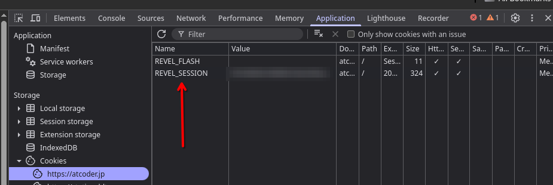

# Getting Token for AtCoder

1. Login to [AtCoder](https://atcoder.jp/)

2. Open developer tools on your web browser using the UI or by pressing `ctrl + shift + i`

3. Go to the `Application` tab, in the storage section, click on cookies, then on "https://atcoder.jp".

4. In this section you should see a cookie named `REVEL_SESSION`, it's "Value" is the token, copy that token and paste it into the script.

